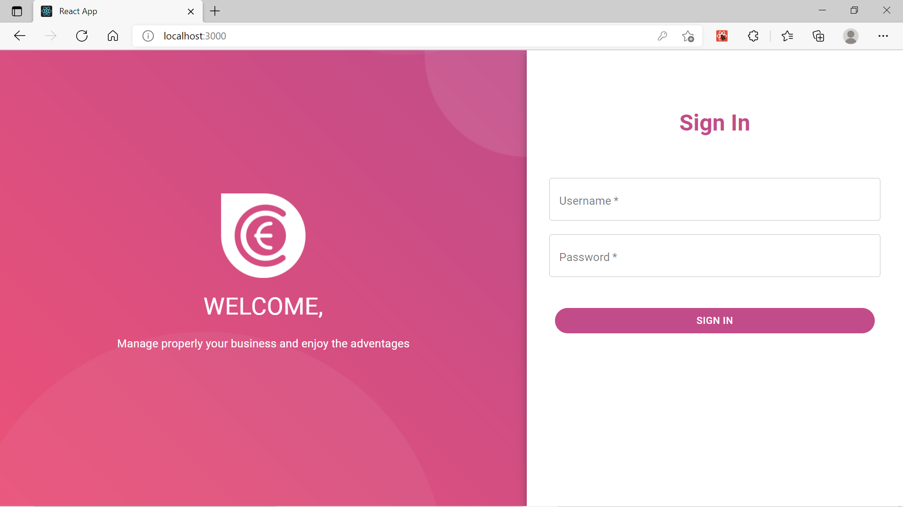
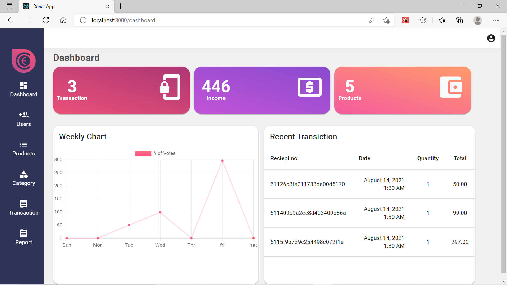

# Cashie

## Summary

This is a Point of Sale application built using React.  
It offers the features for login into account which can be classified into two roles viz. _admin_ and _cashier_

After logging into the account, you can

- Check the dashboard for sales
- Update store and account settings
- Manage users and their access
- Perform transactions and build their cart
- View and filter transactions
- Print receipt for current or previous transactions
- View and manage categories and products

_The project was built for the purpose of submission of my summer training final project._

## Preview Display



<p style="text-align: center">Login Page</p>
<br>



<p style="text-align: center;">Dashboard</p>

## Run the server Locally

### Requirements:

- node >= 14.17.3
- npm >= 7.19.1

### Starting the backend server

```
cd {Relative Path to Project Folder}/backend/
npm install
npm start
```

### Starting the frontend server

```
cd {Relative Path to Project Folder}/frontend/
npm install
npm start
```

_Go to localhost:3000/ in your browser if not redirected automatically_

<br>
